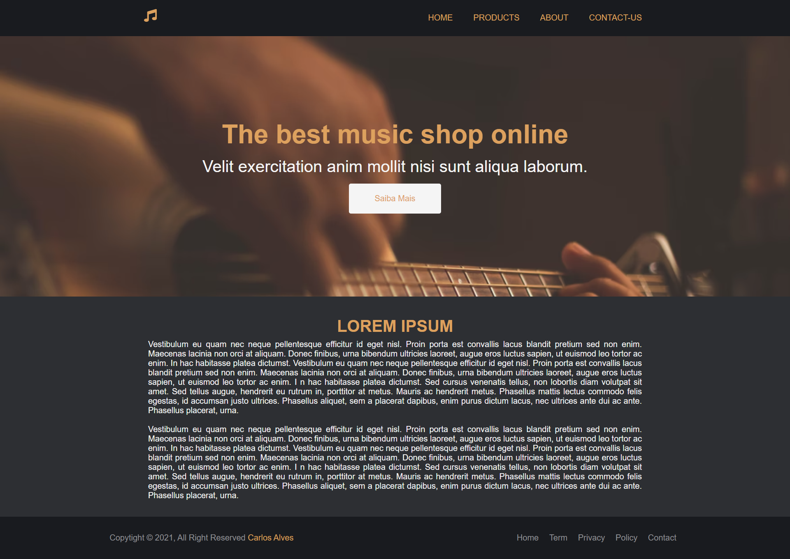
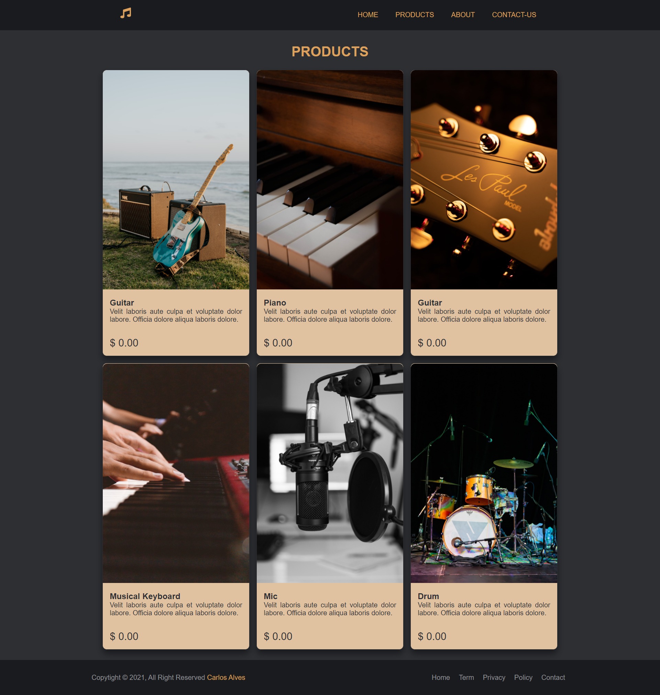
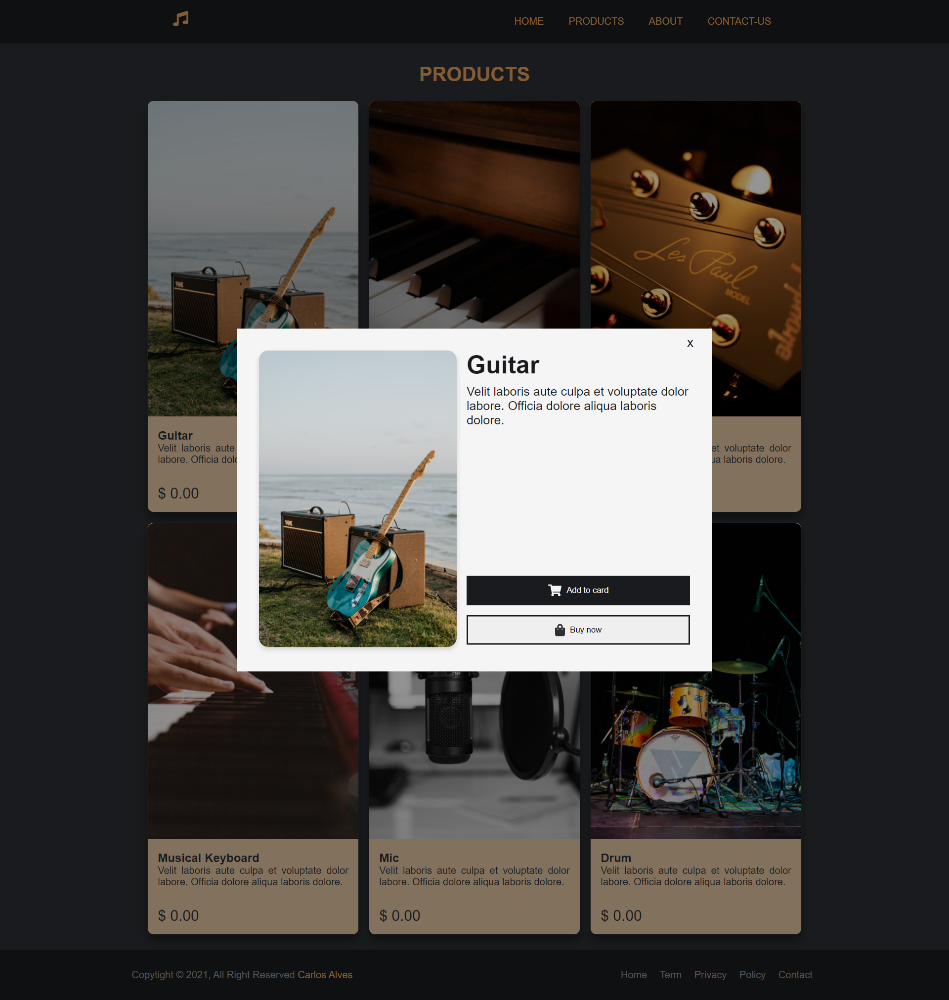
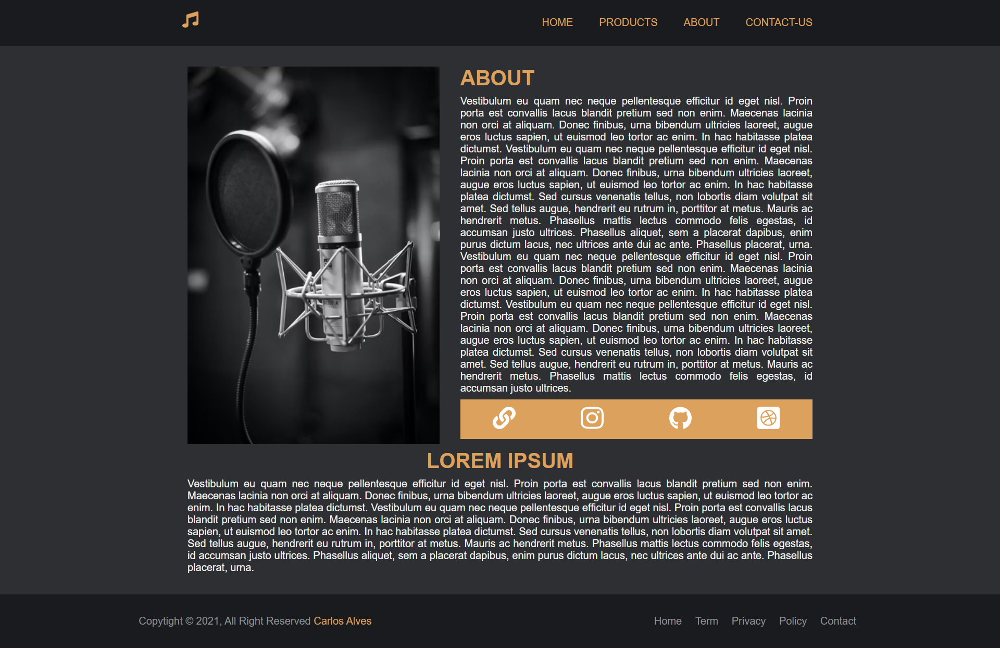
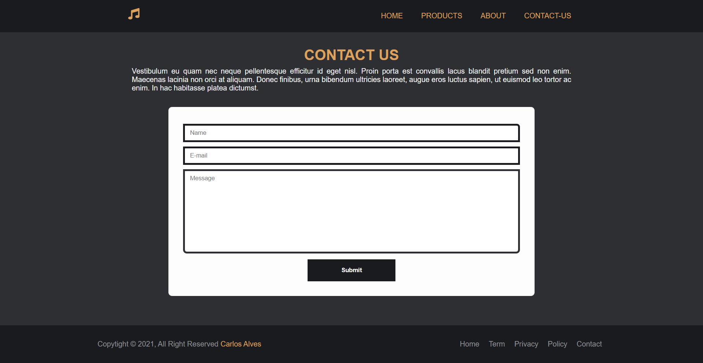

# Music Shop
🔄 Purpose of the repository is to create Music Shop and build routes without using NodeJS

<hr>

### Installation
First install bower globally using node
```
npm install -g bower
```
Fork and Clone the repo:
```
git clone https://github.com/<your-user>/routes-crossroads-music-shop.git && cd routes-crossroads-music-shop
```
**Install the packages:**
Install packages listed in the `bower.json` file using Bower
```
bower install
```

### Run the project
To run the project if you are using VSCode, use the [Live Server](https://marketplace.visualstudio.com/items?itemName=ritwickdey.LiveServer) extension, if you don't want to use this option, just open the project in the **browser**.

### Demo && Project
See the project demonstration in the [video](). To see more projects, go to my [dribbble](https://dribbble.com/eucarlos).
#### 1. Home page


#### 2. Products page


##### 2.1. Modal


#### 3. About page


#### 4. Contact-Us


### Credits
All images used in this project must be assigned to [Unsplash](https://unsplash.com/) and icons assigned to [Font Awesome](https://fontawesome.com/)
